# Rust-MQ Architecture Documentation

## Overview

Rust-MQ là message queue system tương thích Kafka protocol với hai chế độ hoạt động:
- **Single Broker Mode**: In-memory storage, phù hợp cho development
- **Multi-Broker Mode**: Distributed system với Raft consensus

## System Architecture

### High-Level Architecture

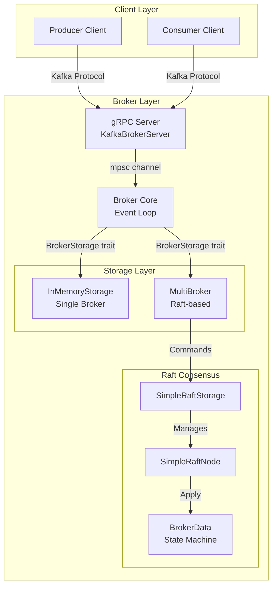

## Core Components

### 1. Client Layer

#### Producer
```rust
pub struct Producer {
    broker_address: String,
    topic: String,
    partition: i32,
    client: KafkaBrokerClient,
    batch_sender: mpsc::Sender<ProducerMessage>,
}
```

**Responsibilities:**
- Connect to broker via gRPC
- Batch messages for efficiency
- Send produce requests
- Handle acknowledgments

#### Consumer
```rust
pub struct Consumer {
    broker_address: String,
    topic: String,
    partition: i32,
    group_id: Option<String>,
    client: KafkaBrokerClient,
    offset: i64,
}
```

**Responsibilities:**
- Subscribe to topics
- Fetch messages continuously
- Commit offsets
- Handle group coordination

### 2. Broker Layer

#### KafkaBrokerServer (gRPC Server)

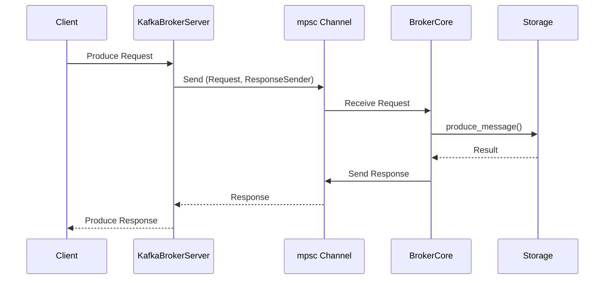

**Key Functions:**
- `produce()`: Handle produce requests
- `fetch()`: Handle fetch requests
- `get_topic_metadata()`: Return topic/partition info
- `commit_offset()`: Commit consumer offsets

#### BrokerCore (Event Loop)

```rust
pub struct BrokerCore<S: BrokerStorage> {
    rpc_receive_channel: mpsc::Receiver<(BrokerGrpcRequest, mpsc::Sender<BrokerGrpcResponse>)>,
    storage: Arc<Mutex<S>>,
}
```

**Event Loop Flow:**

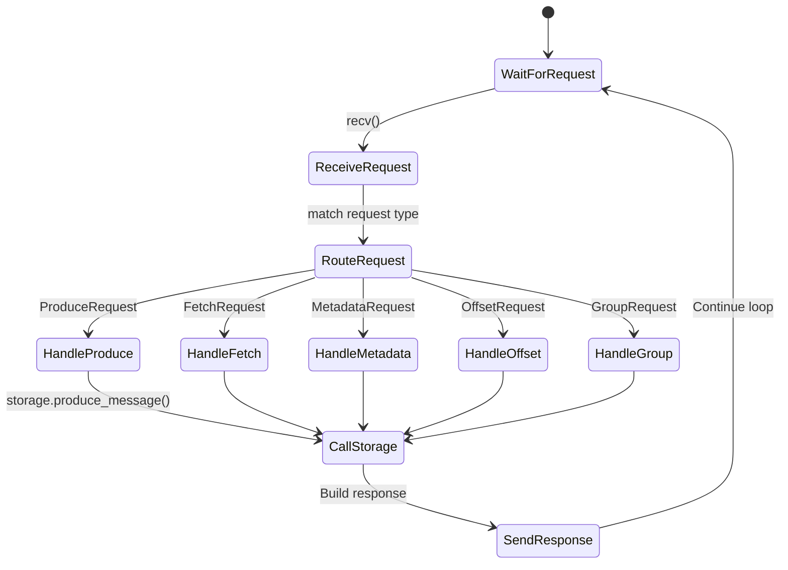

**Responsibilities:**
- Route requests to appropriate handlers
- Coordinate with storage layer
- Send responses back through channels
- Single-threaded async event processing

### 3. Storage Layer

#### BrokerStorage Trait

```rust
#[async_trait]
pub trait BrokerStorage: Send + Sync {
    // Topic operations
    async fn get_topics(&self) -> Vec<String>;
    async fn get_topic_partitions(&self, topic: &str) -> Option<Vec<i32>>;
    
    // Message operations
    async fn produce_message(&mut self, topic: &str, partition: i32, message: Vec<u8>) -> Result<i64, String>;
    async fn fetch_messages(&self, topic: &str, partition: i32, offset: i64, max_bytes: i32) -> Result<(Vec<u8>, i64), String>;
    
    // Offset operations
    async fn commit_offset(&mut self, group: &str, topic: &str, partition: i32, offset: i64, metadata: String) -> Result<(), String>;
    async fn fetch_offset(&self, group: &str, topic: &str, partition: i32) -> Result<(i64, String), String>;
    
    // Group operations
    async fn join_group(&mut self, group_id: &str, member_id: &str, protocol_type: &str) -> Result<(i32, String, String, Vec<GroupMember>), String>;
    async fn leave_group(&mut self, group_id: &str, member_id: &str) -> Result<(), String>;
    async fn heartbeat(&mut self, group_id: &str, generation_id: i32, member_id: &str) -> Result<(), String>;
}
```

**Implementations:**

1. **InMemoryStorage** (Single Broker)
   - HashMap-based storage
   - No persistence
   - Fast for development

2. **MultiBroker** (Raft-based)
   - Distributed storage
   - Raft consensus
   - Leader election & replication

### 4. Raft Consensus Layer

#### Component Relationships

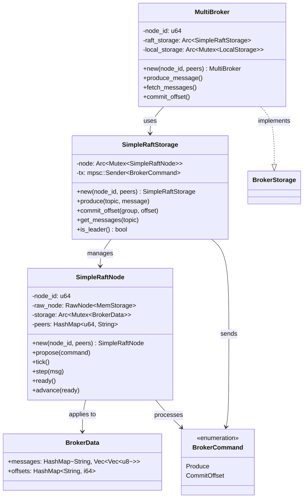

#### Raft Consensus Flow

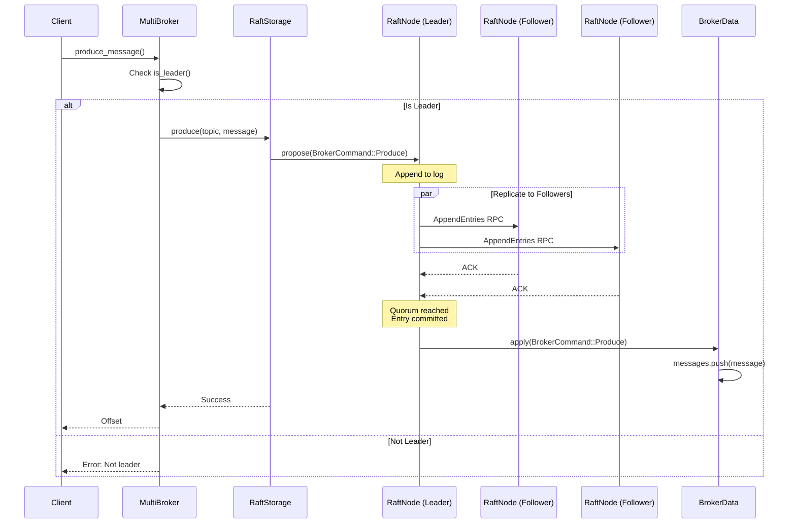

#### Leader Election Process

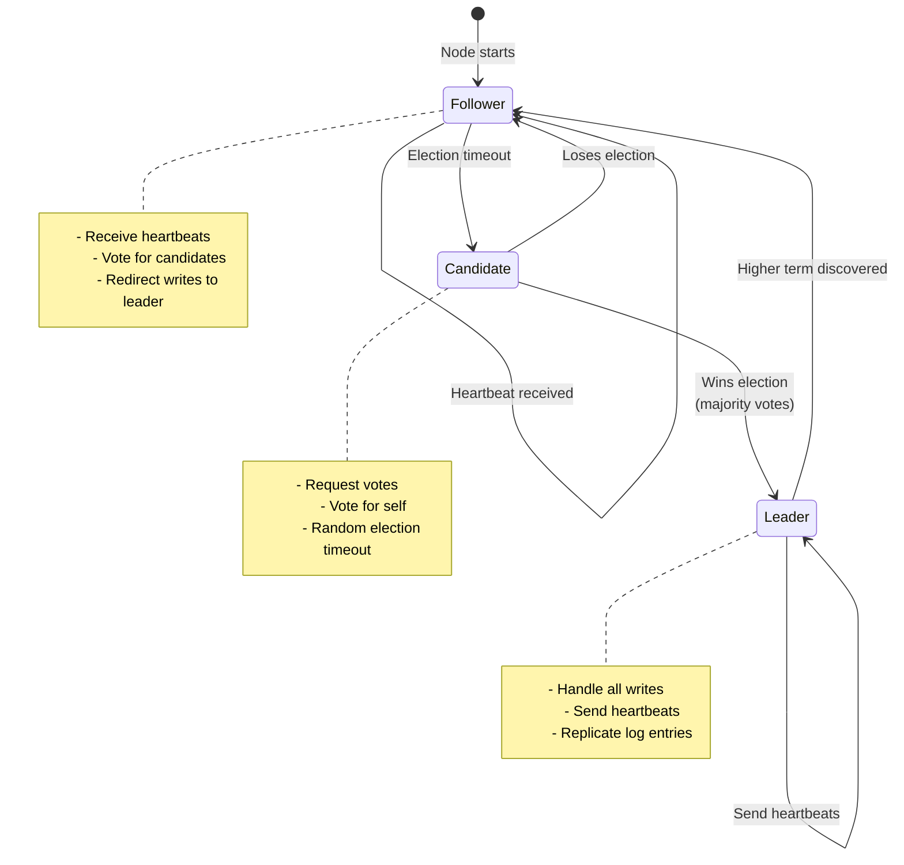

## Data Structures

### BrokerData (Raft State Machine)

```rust
#[derive(Debug, Clone, Serialize, Deserialize)]
pub struct BrokerData {
    // Topic -> Messages
    pub messages: HashMap<String, Vec<Vec<u8>>>,
    // Consumer Group -> Offset
    pub offsets: HashMap<String, i64>,
}
```

**State Transitions:**

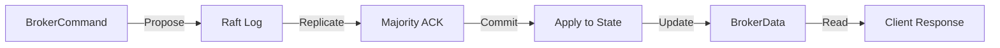

### Configuration

```rust
pub struct BrokerConfig {
    pub node_id: u64,
    pub api_addr: String,      // Client API address
    pub rpc_addr: String,       // Raft RPC address
    pub storage_path: String,   // Data directory
    pub cluster: ClusterConfig,
    pub raft: RaftConfig,
}
```

## Request Flow Examples

### Produce Message Flow

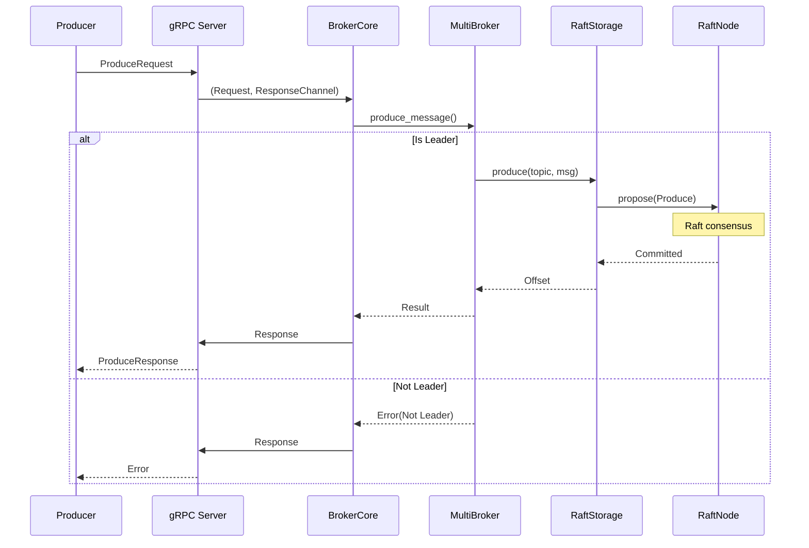

### Fetch Message Flow

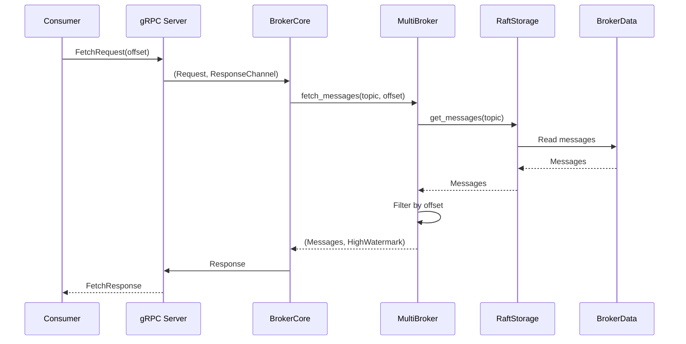

## Concurrency Model

### Single Broker Mode

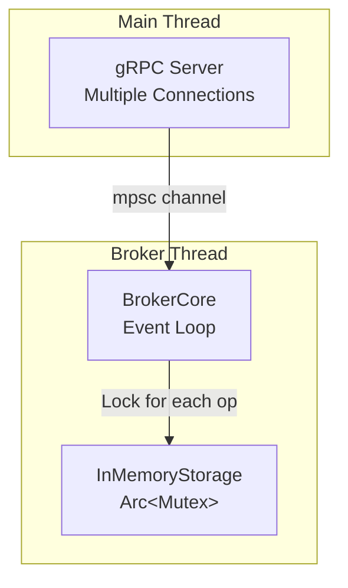

**Characteristics:**
- Single-threaded event loop
- Storage protected by Mutex
- Async/await for I/O

### Multi-Broker Mode

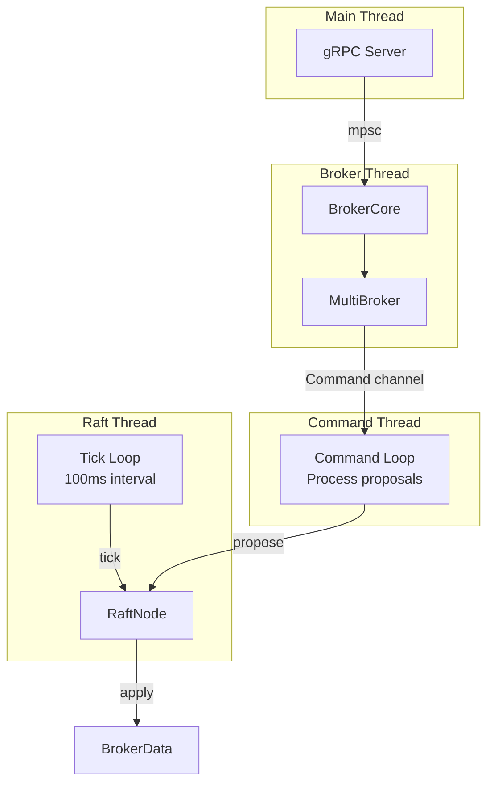

**Characteristics:**
- Multiple background tasks
- Lock-free communication via channels
- Raft tick loop for timeouts/elections
- Separate command processing loop

## Configuration Management

### Config File Structure

```yaml
# Node identity
node_id: 1
api_addr: "127.0.0.1:9092"    # Kafka API
rpc_addr: "127.0.0.1:19092"   # Raft RPC

# Data persistence
storage_path: "./data/broker-1"

# Cluster setup
cluster:
  initial_members:
    - node_id: 1
      api_addr: "127.0.0.1:9092"
      rpc_addr: "127.0.0.1:19092"
  bootstrap: true  # Only true for first node

# Raft tuning
raft:
  heartbeat_interval_ms: 1000
  election_timeout_min_ms: 3000
  election_timeout_max_ms: 6000
```

### Startup Flow

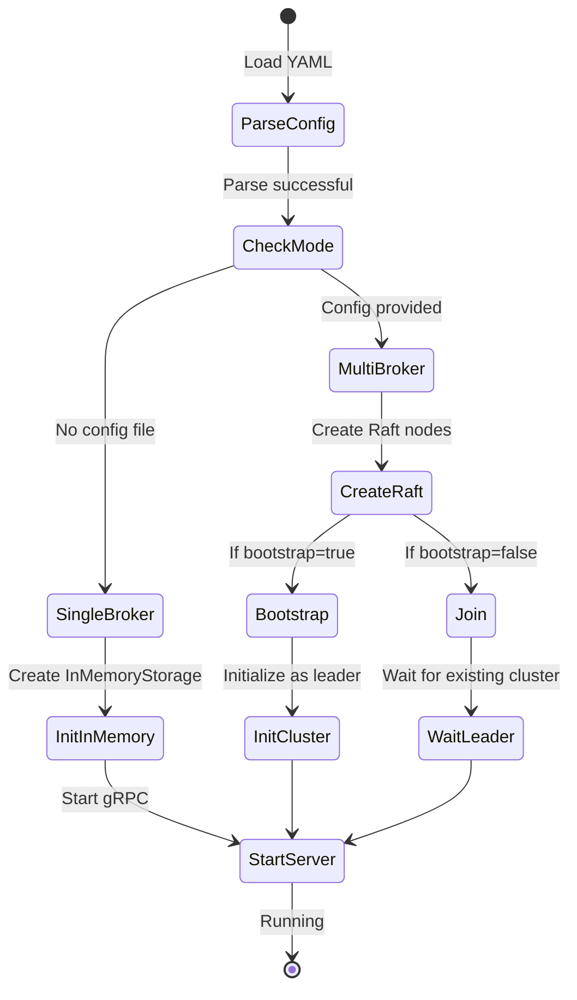

## Error Handling

### Error Types

```rust
// Storage errors
Err("Not leader. Please retry with leader node")
Err("Topic or partition not found")
Err("Unknown member")
Err("Group not found")

// Raft errors
RaftError::Store(...)        // Storage operation failed
RaftError::SnapshotOutOfDate // Snapshot conflict
```

### Retry Strategy

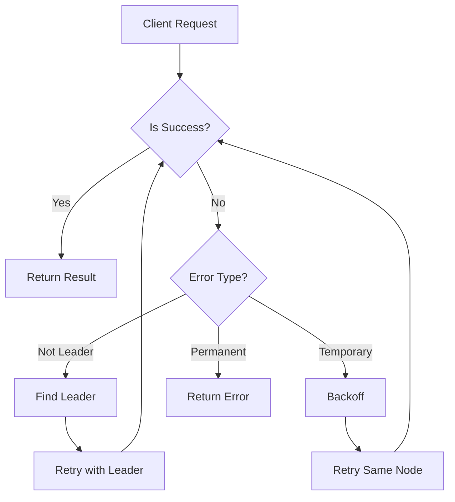

## Performance Considerations

### Single Broker
- **Throughput**: High (no network overhead)
- **Latency**: Low (direct memory access)
- **Scalability**: Limited to single machine

### Multi-Broker
- **Throughput**: Medium (network + consensus overhead)
- **Latency**: Higher (Raft replication)
- **Scalability**: Horizontal (add more nodes)
- **Availability**: High (survives node failures)

### Optimization Techniques

1. **Batching**: Producer batches messages
2. **Async I/O**: Non-blocking operations
3. **Zero-copy**: Direct buffer passing where possible
4. **Pipeline**: Overlapping requests in flight

## Deployment Architecture

### 3-Node Cluster

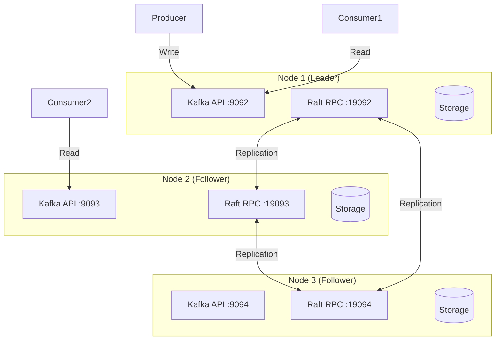

**Fault Tolerance:**
- Tolerates 1 node failure (quorum = 2/3)
- Automatic leader election on failure
- Data replicated to all nodes

## Future Enhancements

1. **Persistent Storage**: Replace MemStorage with RocksDB
2. **Snapshot Transfer**: Optimize catch-up for new nodes
3. **Dynamic Membership**: Add/remove nodes without restart
4. **Multi-Raft**: Partition data across multiple Raft groups
5. **Compression**: Reduce network bandwidth
6. **Metrics**: Prometheus integration for monitoring
