# Rust-MQ Architecture Diagrams

---

## 1. C4 Context — System Overview

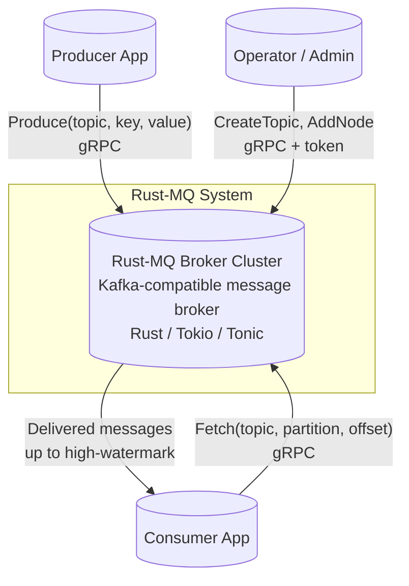
```mermaid
flowchart TB
    subgraph boundary[Rust-MQ System]
        MQ[("Rust-MQ Broker Cluster\nKafka-compatible message broker\nRust / Tokio / Tonic")]
    end

    P[("Producer App")]
    C[("Consumer App")]
    OPS[("Operator / Admin")]

    P -->|"Produce(topic, key, value)\ngRPC"| MQ
    C -->|"Fetch(topic, partition, offset)\ngRPC"| MQ
    OPS -->|"CreateTopic, AddNode\ngRPC + token"| MQ
    MQ -->|"Delivered messages\nup to high-watermark"| C
```

---

## 2. C4 Container — Deployable Units

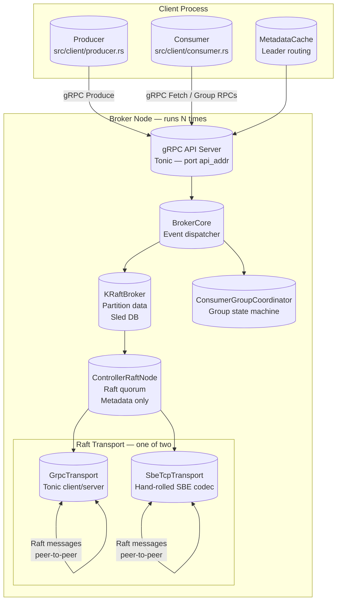
```mermaid
flowchart TB
    subgraph client[Client Process]
        PROD[("Producer\nsrc/client/producer.rs")]
        CONS[("Consumer\nsrc/client/consumer.rs")]
        MC[("MetadataCache\nLeader routing")]
    end

    subgraph broker[Broker Node — runs N times]
        GRPC[("gRPC API Server\nTonic — port api_addr")]
        CORE[("BrokerCore\nEvent dispatcher")]
        KRAFT[("KRaftBroker\nPartition data\nSled DB")]
        CTRL[("ControllerRaftNode\nRaft quorum\nMetadata only")]
        CGC[("ConsumerGroupCoordinator\nGroup state machine")]

        subgraph raft_transport[Raft Transport — one of two]
            GRPC_T[("GrpcTransport\nTonic client/server")]
            SBE_T[("SbeTcpTransport\nHand-rolled SBE codec")]
        end
    end

    PROD -->|"gRPC Produce"| GRPC
    CONS -->|"gRPC Fetch / Group RPCs"| GRPC
    GRPC --> CORE
    CORE --> KRAFT
    CORE --> CGC
    KRAFT --> CTRL
    CTRL --> GRPC_T
    CTRL --> SBE_T
    GRPC_T <-->|"Raft messages\npeer-to-peer"| GRPC_T
    SBE_T <-->|"Raft messages\npeer-to-peer"| SBE_T
    MC --> GRPC
```

---

## 3. C4 Component — Broker Internals

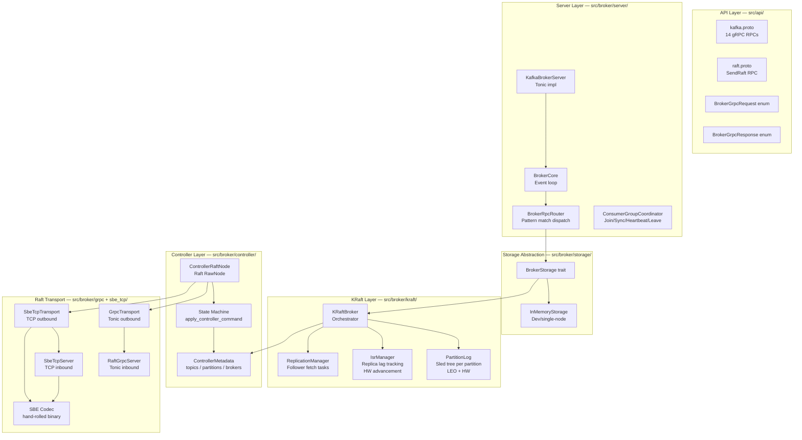
```mermaid
flowchart TB
    subgraph api_layer[API Layer — src/api/]
        KP[kafka.proto\n14 gRPC RPCs]
        RP[raft.proto\nSendRaft RPC]
        REQ[BrokerGrpcRequest enum]
        RES[BrokerGrpcResponse enum]
    end

    subgraph server_layer[Server Layer — src/broker/server/]
        KBS[KafkaBrokerServer\nTonic impl]
        BC[BrokerCore\nEvent loop]
        RR[BrokerRpcRouter\nPattern match dispatch]
        CGC[ConsumerGroupCoordinator\nJoin/Sync/Heartbeat/Leave]
    end

    subgraph storage_layer[Storage Abstraction — src/broker/storage/]
        BST[BrokerStorage trait]
        IMS[InMemoryStorage\nDev/single-node]
    end

    subgraph kraft_layer[KRaft Layer — src/broker/kraft/]
        KB[KRaftBroker\nOrchestrator]
        PL[PartitionLog\nSled tree per partition\nLEO + HW]
        ISR[IsrManager\nReplica lag tracking\nHW advancement]
        RM[ReplicationManager\nFollower fetch tasks]
    end

    subgraph controller_layer[Controller Layer — src/broker/controller/]
        CRN[ControllerRaftNode\nRaft RawNode]
        SM[State Machine\napply_controller_command]
        CM[ControllerMetadata\ntopics / partitions / brokers]
    end

    subgraph transport_layer[Raft Transport — src/broker/grpc + sbe_tcp/]
        GT[GrpcTransport\nTonic outbound]
        GS[RaftGrpcServer\nTonic inbound]
        ST[SbeTcpTransport\nTCP outbound]
        SS[SbeTcpServer\nTCP inbound]
        SC[SBE Codec\nhand-rolled binary]
    end

    KBS --> BC
    BC --> RR
    RR --> BST
    BST --> IMS
    BST --> KB
    KB --> PL
    KB --> ISR
    KB --> RM
    KB --> CM
    CRN --> SM
    SM --> CM
    CRN --> GT
    CRN --> ST
    GT --> GS
    ST --> SS
    SS --> SC
    ST --> SC
```

---

## 4. Sequence — Produce Flow (acks=1)

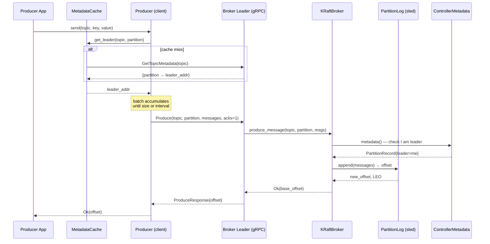
```mermaid
sequenceDiagram
    participant PA as Producer App
    participant MC as MetadataCache
    participant PL as Producer (client)
    participant BK as Broker Leader (gRPC)
    participant KR as KRaftBroker
    participant LOG as PartitionLog (sled)
    participant CTRL as ControllerMetadata

    PA->>PL: send(topic, key, value)
    PL->>MC: get_leader(topic, partition)
    alt cache miss
        MC->>BK: GetTopicMetadata(topic)
        BK-->>MC: {partition → leader_addr}
    end
    MC-->>PL: leader_addr

    note over PL: batch accumulates<br/>until size or interval

    PL->>BK: Produce(topic, partition, messages, acks=1)
    BK->>KR: produce_message(topic, partition, msgs)
    KR->>CTRL: metadata() — check I am leader
    CTRL-->>KR: PartitionRecord{leader=me}
    KR->>LOG: append(messages) → offset
    LOG-->>KR: new_offset, LEO
    KR-->>BK: Ok(base_offset)
    BK-->>PL: ProduceResponse{offset}
    PL-->>PA: Ok(offset)
```

---

## 5. Sequence — Produce Flow (acks=-1, all replicas)

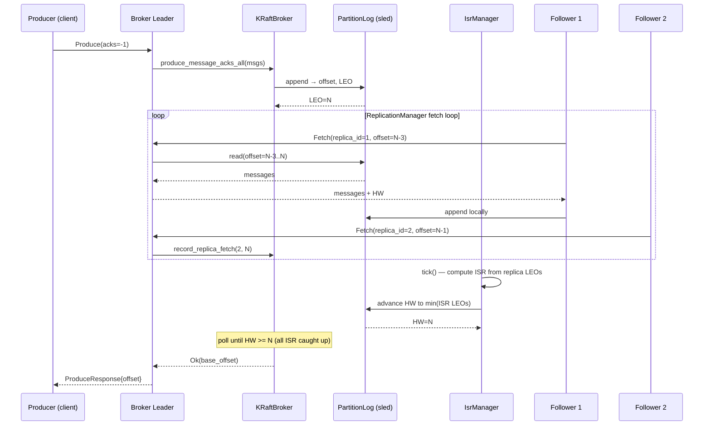
```mermaid
sequenceDiagram
    participant PL as Producer (client)
    participant BK as Broker Leader
    participant KR as KRaftBroker
    participant LOG as PartitionLog (sled)
    participant ISR as IsrManager
    participant F1 as Follower 1
    participant F2 as Follower 2

    PL->>BK: Produce(acks=-1)
    BK->>KR: produce_message_acks_all(msgs)
    KR->>LOG: append → offset, LEO
    LOG-->>KR: LEO=N

    loop ReplicationManager fetch loop
        F1->>BK: Fetch(replica_id=1, offset=N-3)
        BK->>LOG: read(offset=N-3..N)
        LOG-->>BK: messages
        BK-->>F1: messages + HW
        F1->>LOG: append locally

        F2->>BK: Fetch(replica_id=2, offset=N-1)
        BK->>KR: record_replica_fetch(2, N)
    end

    ISR->>ISR: tick() — compute ISR from replica LEOs
    ISR->>LOG: advance HW to min(ISR LEOs)
    LOG-->>ISR: HW=N

    note over KR: poll until HW >= N (all ISR caught up)
    KR-->>BK: Ok(base_offset)
    BK-->>PL: ProduceResponse{offset}
```

---

## 6. Sequence — Consume Flow (Consumer Group)

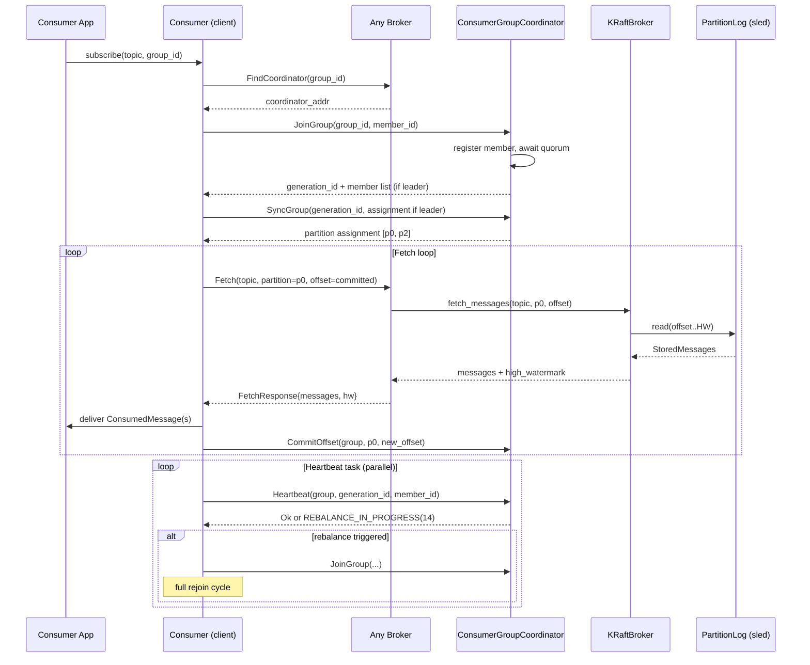
```mermaid
sequenceDiagram
    participant CA as Consumer App
    participant CO as Consumer (client)
    participant BK as Any Broker
    participant CGC as ConsumerGroupCoordinator
    participant KR as KRaftBroker
    participant LOG as PartitionLog (sled)

    CA->>CO: subscribe(topic, group_id)
    CO->>BK: FindCoordinator(group_id)
    BK-->>CO: coordinator_addr

    CO->>CGC: JoinGroup(group_id, member_id)
    CGC->>CGC: register member, await quorum
    CGC-->>CO: generation_id + member list (if leader)

    CO->>CGC: SyncGroup(generation_id, assignment if leader)
    CGC-->>CO: partition assignment [p0, p2]

    loop Fetch loop
        CO->>BK: Fetch(topic, partition=p0, offset=committed)
        BK->>KR: fetch_messages(topic, p0, offset)
        KR->>LOG: read(offset..HW)
        LOG-->>KR: StoredMessages
        KR-->>BK: messages + high_watermark
        BK-->>CO: FetchResponse{messages, hw}
        CO->>CA: deliver ConsumedMessage(s)
        CO->>CGC: CommitOffset(group, p0, new_offset)
    end

    loop Heartbeat task (parallel)
        CO->>CGC: Heartbeat(group, generation_id, member_id)
        CGC-->>CO: Ok or REBALANCE_IN_PROGRESS(14)
        alt rebalance triggered
            CO->>CGC: JoinGroup(...)
            note over CO: full rejoin cycle
        end
    end
```

---

## 7. Sequence — Raft Metadata Proposal (CreateTopic)

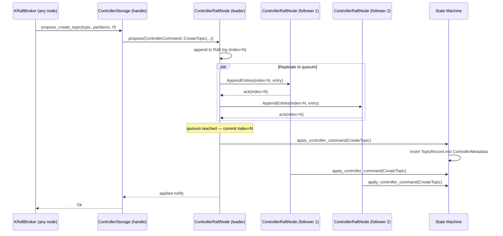
```mermaid
sequenceDiagram
    participant BK as KRaftBroker (any node)
    participant CS as ControllerStorage (handle)
    participant LDR as ControllerRaftNode (leader)
    participant F1 as ControllerRaftNode (follower 1)
    participant F2 as ControllerRaftNode (follower 2)
    participant SM as State Machine

    BK->>CS: propose_create_topic(topic, partitions, rf)
    CS->>LDR: propose(ControllerCommand::CreateTopic{...})
    LDR->>LDR: append to Raft log (index=N)

    par Replicate to quorum
        LDR->>F1: AppendEntries(index=N, entry)
        F1-->>LDR: ack(index=N)
        LDR->>F2: AppendEntries(index=N, entry)
        F2-->>LDR: ack(index=N)
    end

    note over LDR: quorum reached — commit index=N

    LDR->>SM: apply_controller_command(CreateTopic)
    SM->>SM: insert TopicRecord into ControllerMetadata
    F1->>SM: apply_controller_command(CreateTopic)
    F2->>SM: apply_controller_command(CreateTopic)

    LDR-->>CS: applied notify
    CS-->>BK: Ok
```

---

## 8. Sequence — Broker Failure Detection & Failover

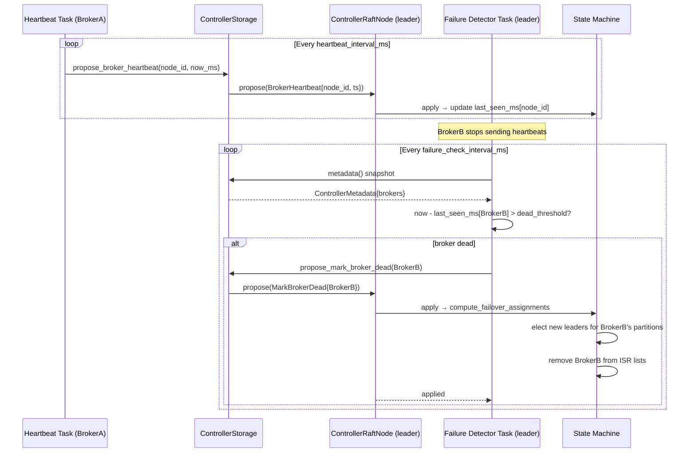
```mermaid
sequenceDiagram
    participant HB as Heartbeat Task (BrokerA)
    participant CS as ControllerStorage
    participant LDR as ControllerRaftNode (leader)
    participant FD as Failure Detector Task (leader)
    participant SM as State Machine

    loop Every heartbeat_interval_ms
        HB->>CS: propose_broker_heartbeat(node_id, now_ms)
        CS->>LDR: propose(BrokerHeartbeat{node_id, ts})
        LDR->>SM: apply → update last_seen_ms[node_id]
    end

    note over FD: BrokerB stops sending heartbeats

    loop Every failure_check_interval_ms
        FD->>CS: metadata() snapshot
        CS-->>FD: ControllerMetadata{brokers}
        FD->>FD: now - last_seen_ms[BrokerB] > dead_threshold?
        alt broker dead
            FD->>CS: propose_mark_broker_dead(BrokerB)
            CS->>LDR: propose(MarkBrokerDead{BrokerB})
            LDR->>SM: apply → compute_failover_assignments
            SM->>SM: elect new leaders for BrokerB's partitions
            SM->>SM: remove BrokerB from ISR lists
            LDR-->>FD: applied
        end
    end
```

---

## 9. State Diagram — Consumer Group Lifecycle

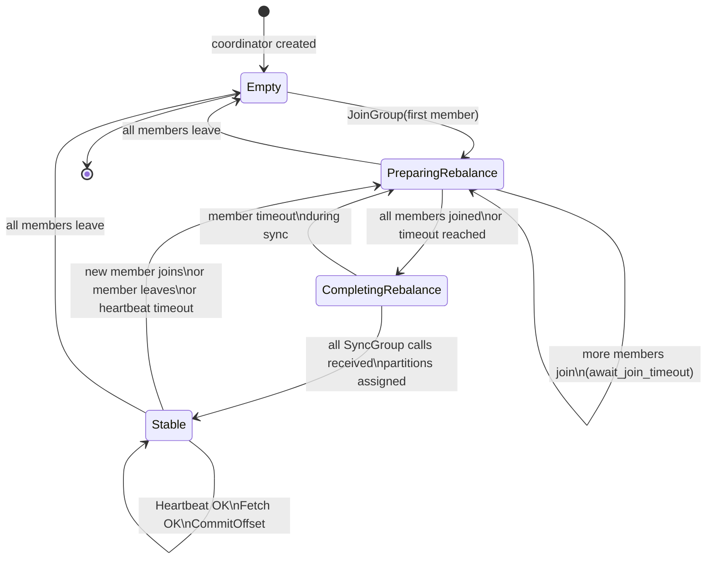
```mermaid
stateDiagram-v2
    [*] --> Empty : coordinator created

    Empty --> PreparingRebalance : JoinGroup(first member)
    PreparingRebalance --> PreparingRebalance : more members join\n(await_join_timeout)
    PreparingRebalance --> CompletingRebalance : all members joined\nor timeout reached

    CompletingRebalance --> Stable : all SyncGroup calls received\npartitions assigned

    Stable --> PreparingRebalance : new member joins\nor member leaves\nor heartbeat timeout
    Stable --> Stable : Heartbeat OK\nFetch OK\nCommitOffset

    CompletingRebalance --> PreparingRebalance : member timeout\nduring sync

    Stable --> Empty : all members leave
    PreparingRebalance --> Empty : all members leave
    Empty --> [*]
```

---

## 10. State Diagram — Partition Replica States

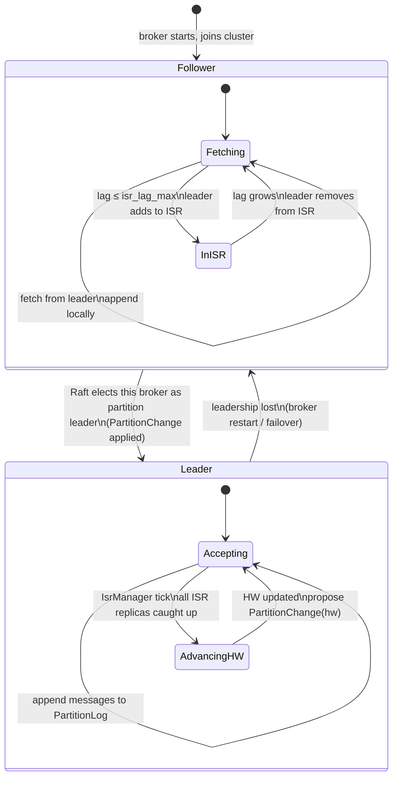
```mermaid
stateDiagram-v2
    [*] --> Follower : broker starts, joins cluster

    Follower --> Leader : Raft elects this broker as partition leader\n(PartitionChange applied)
    Leader --> Follower : leadership lost\n(broker restart / failover)

    state Leader {
        [*] --> Accepting
        Accepting --> Accepting : append messages to PartitionLog
        Accepting --> AdvancingHW : IsrManager tick\nall ISR replicas caught up
        AdvancingHW --> Accepting : HW updated\npropose PartitionChange(hw)
    }

    state Follower {
        [*] --> Fetching
        Fetching --> Fetching : fetch from leader\nappend locally
        Fetching --> InISR : lag ≤ isr_lag_max\nleader adds to ISR
        InISR --> Fetching : lag grows\nleader removes from ISR
    }
```

---

## 11. Flowchart — Module Dependency Graph

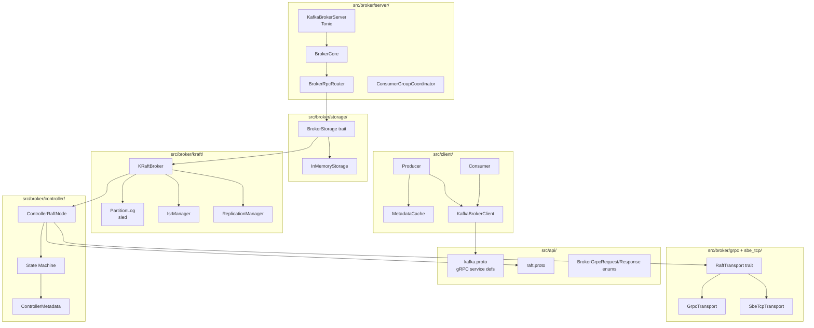
```mermaid
flowchart TD
    subgraph api[src/api/]
        KP[kafka.proto\ngRPC service defs]
        RP[raft.proto]
        RQ[BrokerGrpcRequest/Response enums]
    end

    subgraph server[src/broker/server/]
        KBS[KafkaBrokerServer\nTonic]
        BC[BrokerCore]
        RR[BrokerRpcRouter]
        CGC[ConsumerGroupCoordinator]
    end

    subgraph storage[src/broker/storage/]
        BST[BrokerStorage trait]
        IMS[InMemoryStorage]
    end

    subgraph kraft[src/broker/kraft/]
        KB[KRaftBroker]
        PL[PartitionLog\nsled]
        ISR_M[IsrManager]
        RM[ReplicationManager]
    end

    subgraph controller[src/broker/controller/]
        CRN[ControllerRaftNode]
        SM_C[State Machine]
        CM[ControllerMetadata]
    end

    subgraph transport[src/broker/grpc + sbe_tcp/]
        RT[RaftTransport trait]
        GT[GrpcTransport]
        ST[SbeTcpTransport]
    end

    subgraph client[src/client/]
        PROD[Producer]
        CONS[Consumer]
        MC[MetadataCache]
        KBC[KafkaBrokerClient]
    end

    KBS --> BC
    BC --> RR
    RR --> BST
    BST --> IMS
    BST --> KB
    KB --> PL
    KB --> ISR_M
    KB --> RM
    KB --> CRN
    CRN --> SM_C
    SM_C --> CM
    CRN --> RT
    RT --> GT
    RT --> ST
    PROD --> KBC
    CONS --> KBC
    PROD --> MC
    KBC --> KP
    CRN --> RP
```

---

## 12. Flowchart — Startup Initialization

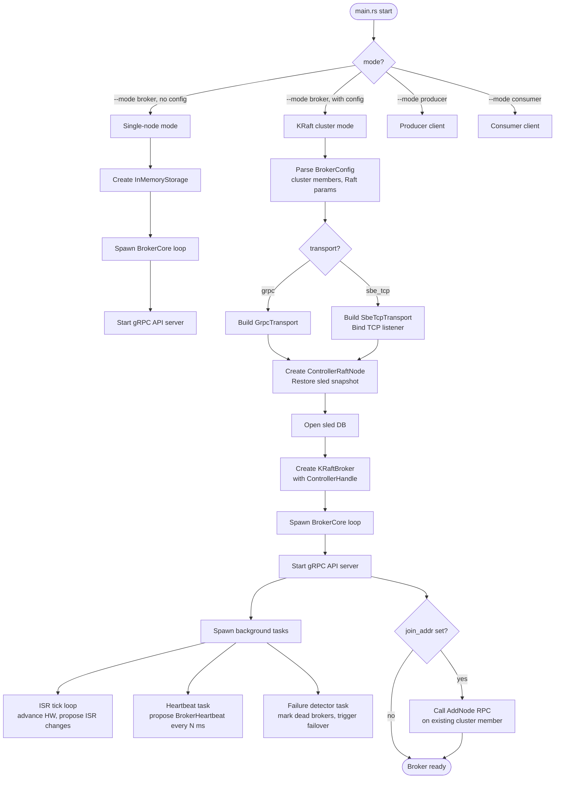
```mermaid
flowchart TD
    START([main.rs start]) --> MODE{mode?}

    MODE -->|--mode broker, no config| SINGLE[Single-node mode]
    MODE -->|--mode broker, with config| CLUSTER[KRaft cluster mode]
    MODE -->|--mode producer| PROD_MODE[Producer client]
    MODE -->|--mode consumer| CONS_MODE[Consumer client]

    SINGLE --> IMS_INIT[Create InMemoryStorage]
    IMS_INIT --> BC_INIT[Spawn BrokerCore loop]
    BC_INIT --> GRPC_START[Start gRPC API server]

    CLUSTER --> PARSE[Parse BrokerConfig\ncluster members, Raft params]
    PARSE --> TRANS{transport?}
    TRANS -->|grpc| GT_INIT[Build GrpcTransport]
    TRANS -->|sbe_tcp| ST_INIT[Build SbeTcpTransport\nBind TCP listener]
    GT_INIT --> CTRL_INIT
    ST_INIT --> CTRL_INIT

    CTRL_INIT[Create ControllerRaftNode\nRestore sled snapshot] --> SLED[Open sled DB]
    SLED --> KB_INIT[Create KRaftBroker\nwith ControllerHandle]
    KB_INIT --> CORE_INIT[Spawn BrokerCore loop]
    CORE_INIT --> GRPC_CLUSTER[Start gRPC API server]
    GRPC_CLUSTER --> BG[Spawn background tasks]

    BG --> ISR_TICK[ISR tick loop\nadvance HW, propose ISR changes]
    BG --> HB_TASK[Heartbeat task\npropose BrokerHeartbeat every N ms]
    BG --> FD_TASK[Failure detector task\nmark dead brokers, trigger failover]

    GRPC_CLUSTER --> JOIN{join_addr set?}
    JOIN -->|yes| ADD_NODE[Call AddNode RPC\non existing cluster member]
    JOIN -->|no| READY([Broker ready])
    ADD_NODE --> READY
```

---

## 13. Class Diagram — Core Domain Types

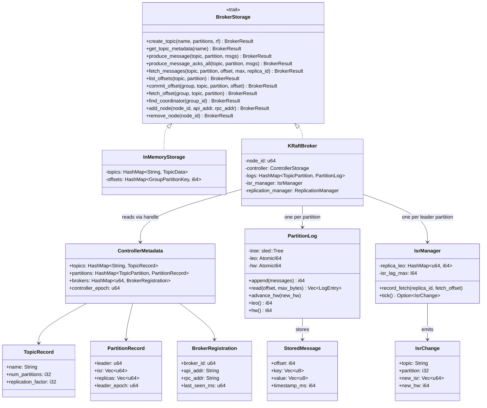
```mermaid
classDiagram
    class BrokerStorage {
        <<trait>>
        +create_topic(name, partitions, rf) BrokerResult
        +get_topic_metadata(name) BrokerResult
        +produce_message(topic, partition, msgs) BrokerResult
        +produce_message_acks_all(topic, partition, msgs) BrokerResult
        +fetch_messages(topic, partition, offset, max, replica_id) BrokerResult
        +list_offsets(topic, partition) BrokerResult
        +commit_offset(group, topic, partition, offset) BrokerResult
        +fetch_offset(group, topic, partition) BrokerResult
        +find_coordinator(group_id) BrokerResult
        +add_node(node_id, api_addr, rpc_addr) BrokerResult
        +remove_node(node_id) BrokerResult
    }

    class InMemoryStorage {
        -topics: HashMap~String, TopicData~
        -offsets: HashMap~GroupPartitionKey, i64~
    }

    class KRaftBroker {
        -node_id: u64
        -controller: ControllerStorage
        -logs: HashMap~TopicPartition, PartitionLog~
        -isr_manager: IsrManager
        -replication_manager: ReplicationManager
    }

    class ControllerMetadata {
        +topics: HashMap~String, TopicRecord~
        +partitions: HashMap~TopicPartition, PartitionRecord~
        +brokers: HashMap~u64, BrokerRegistration~
        +controller_epoch: u64
    }

    class PartitionRecord {
        +leader: u64
        +isr: Vec~u64~
        +replicas: Vec~u64~
        +leader_epoch: u64
    }

    class TopicRecord {
        +name: String
        +num_partitions: i32
        +replication_factor: i32
    }

    class BrokerRegistration {
        +broker_id: u64
        +api_addr: String
        +rpc_addr: String
        +last_seen_ms: u64
    }

    class PartitionLog {
        -tree: sled::Tree
        -leo: AtomicI64
        -hw: AtomicI64
        +append(messages) i64
        +read(offset, max_bytes) Vec~LogEntry~
        +advance_hw(new_hw)
        +leo() i64
        +hw() i64
    }

    class IsrManager {
        -replica_leo: HashMap~u64, i64~
        -isr_lag_max: i64
        +record_fetch(replica_id, fetch_offset)
        +tick() Option~IsrChange~
    }

    class IsrChange {
        +topic: String
        +partition: i32
        +new_isr: Vec~u64~
        +new_hw: i64
    }

    class StoredMessage {
        +offset: i64
        +key: Vec~u8~
        +value: Vec~u8~
        +timestamp_ms: i64
    }

    BrokerStorage <|.. InMemoryStorage
    BrokerStorage <|.. KRaftBroker
    KRaftBroker --> ControllerMetadata : reads via handle
    KRaftBroker --> PartitionLog : one per partition
    KRaftBroker --> IsrManager : one per leader partition
    ControllerMetadata --> TopicRecord
    ControllerMetadata --> PartitionRecord
    ControllerMetadata --> BrokerRegistration
    IsrManager --> IsrChange : emits
    PartitionLog --> StoredMessage : stores
```

---

## 14. Class Diagram — Client Types

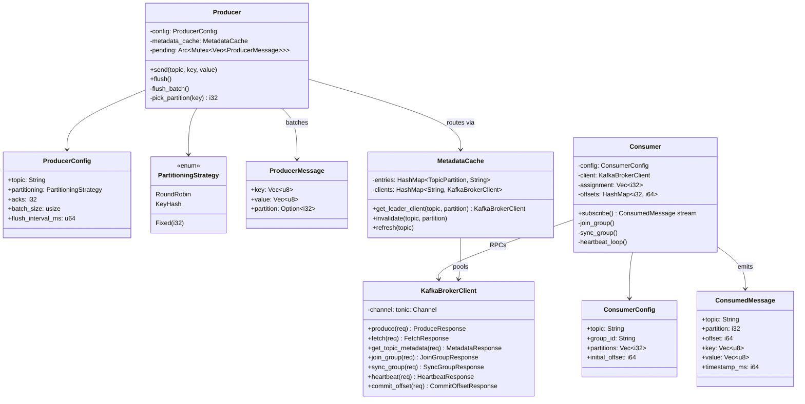
```mermaid
classDiagram
    class Producer {
        -config: ProducerConfig
        -metadata_cache: MetadataCache
        -pending: Arc~Mutex~Vec~ProducerMessage~~~
        +send(topic, key, value)
        +flush()
        -flush_batch()
        -pick_partition(key) i32
    }

    class ProducerConfig {
        +topic: String
        +partitioning: PartitioningStrategy
        +acks: i32
        +batch_size: usize
        +flush_interval_ms: u64
    }

    class PartitioningStrategy {
        <<enum>>
        Fixed(i32)
        RoundRobin
        KeyHash
    }

    class ProducerMessage {
        +key: Vec~u8~
        +value: Vec~u8~
        +partition: Option~i32~
    }

    class Consumer {
        -config: ConsumerConfig
        -client: KafkaBrokerClient
        -assignment: Vec~i32~
        -offsets: HashMap~i32, i64~
        +subscribe() ConsumedMessage stream
        -join_group()
        -sync_group()
        -heartbeat_loop()
    }

    class ConsumerConfig {
        +topic: String
        +group_id: String
        +partitions: Vec~i32~
        +initial_offset: i64
    }

    class ConsumedMessage {
        +topic: String
        +partition: i32
        +offset: i64
        +key: Vec~u8~
        +value: Vec~u8~
        +timestamp_ms: i64
    }

    class MetadataCache {
        -entries: HashMap~TopicPartition, String~
        -clients: HashMap~String, KafkaBrokerClient~
        +get_leader_client(topic, partition) KafkaBrokerClient
        +invalidate(topic, partition)
        +refresh(topic)
    }

    class KafkaBrokerClient {
        -channel: tonic::Channel
        +produce(req) ProduceResponse
        +fetch(req) FetchResponse
        +get_topic_metadata(req) MetadataResponse
        +join_group(req) JoinGroupResponse
        +sync_group(req) SyncGroupResponse
        +heartbeat(req) HeartbeatResponse
        +commit_offset(req) CommitOffsetResponse
    }

    Producer --> MetadataCache : routes via
    Producer --> ProducerConfig
    Producer --> ProducerMessage : batches
    Producer --> PartitioningStrategy
    Consumer --> ConsumerConfig
    Consumer --> KafkaBrokerClient : RPCs
    Consumer --> ConsumedMessage : emits
    MetadataCache --> KafkaBrokerClient : pools
```

---

## 15. ER Diagram — ControllerMetadata (in-memory state machine)

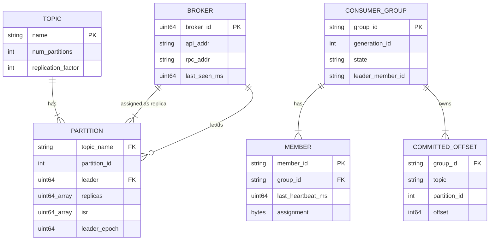
```mermaid
erDiagram
    TOPIC ||--|{ PARTITION : "has"
    BROKER ||--|{ PARTITION : "assigned as replica"
    BROKER ||--o{ PARTITION : "leads"

    TOPIC {
        string name PK
        int num_partitions
        int replication_factor
    }

    PARTITION {
        string topic_name FK
        int partition_id
        uint64 leader FK
        uint64_array replicas
        uint64_array isr
        uint64 leader_epoch
    }

    BROKER {
        uint64 broker_id PK
        string api_addr
        string rpc_addr
        uint64 last_seen_ms
    }

    CONSUMER_GROUP ||--|{ MEMBER : "has"
    CONSUMER_GROUP ||--|{ COMMITTED_OFFSET : "owns"

    CONSUMER_GROUP {
        string group_id PK
        int generation_id
        string state
        string leader_member_id
    }

    MEMBER {
        string member_id PK
        string group_id FK
        uint64 last_heartbeat_ms
        bytes assignment
    }

    COMMITTED_OFFSET {
        string group_id FK
        string topic
        int partition_id
        int64 offset
    }
```

---

## 16. Flowchart — Producer Partition Routing & Retry

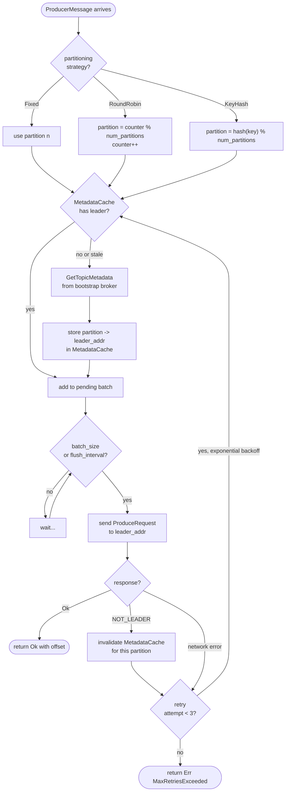
```mermaid
flowchart TD
    MSG([ProducerMessage arrives]) --> STRAT{partitioning\nstrategy?}

    STRAT -->|Fixed| FIXED[use partition n]
    STRAT -->|RoundRobin| RR["partition = counter % num_partitions\ncounter++"]
    STRAT -->|KeyHash| KH["partition = hash(key) % num_partitions"]

    FIXED --> CACHE
    RR --> CACHE
    KH --> CACHE

    CACHE{MetadataCache\nhas leader?} -->|yes| BATCH
    CACHE -->|no or stale| FETCH[GetTopicMetadata\nfrom bootstrap broker]
    FETCH --> STORE["store partition -> leader_addr\nin MetadataCache"]
    STORE --> BATCH

    BATCH[add to pending batch] --> FULL{batch_size\nor flush_interval?}
    FULL -->|no| WAIT[wait...]
    WAIT --> FULL
    FULL -->|yes| SEND[send ProduceRequest\nto leader_addr]

    SEND --> RESP{response?}
    RESP -->|Ok| DONE([return Ok with offset])
    RESP -->|NOT_LEADER| INVAL[invalidate MetadataCache\nfor this partition]
    INVAL --> RETRY{retry\nattempt < 3?}
    RETRY -->|yes, exponential backoff| CACHE
    RETRY -->|no| ERR([return Err MaxRetriesExceeded])
    RESP -->|network error| RETRY
```

---

## 17. Flowchart — ISR Computation & HW Advancement

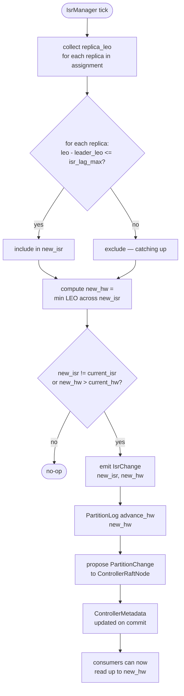
```mermaid
flowchart TD
    TICK([IsrManager tick]) --> COLLECT[collect replica_leo\nfor each replica in assignment]

    COLLECT --> COMPARE{for each replica:\nleo - leader_leo <= isr_lag_max?}

    COMPARE -->|yes| ADD_ISR[include in new_isr]
    COMPARE -->|no| EXCLUDE[exclude — catching up]

    ADD_ISR --> HW[compute new_hw =\nmin LEO across new_isr]
    EXCLUDE --> HW

    HW --> CHANGED{new_isr != current_isr\nor new_hw > current_hw?}

    CHANGED -->|no| NOOP([no-op])
    CHANGED -->|yes| EMIT[emit IsrChange\nnew_isr, new_hw]

    EMIT --> UPDATE_LOG[PartitionLog advance_hw\nnew_hw]
    UPDATE_LOG --> PROPOSE[propose PartitionChange\nto ControllerRaftNode]
    PROPOSE --> CTRL[ControllerMetadata\nupdated on commit]
    CTRL --> VISIBLE[consumers can now\nread up to new_hw]
```

---

## 18. Flowchart — Dynamic Cluster Join

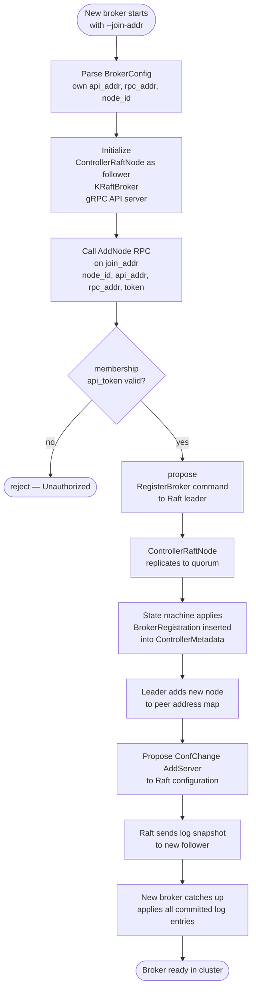
```mermaid
flowchart TD
    NEW([New broker starts\nwith --join-addr]) --> PARSE[Parse BrokerConfig\nown api_addr, rpc_addr, node_id]

    PARSE --> INIT[Initialize\nControllerRaftNode as follower\nKRaftBroker\ngRPC API server]

    INIT --> CALL[Call AddNode RPC\non join_addr\nnode_id, api_addr, rpc_addr, token]

    CALL --> AUTH{membership\napi_token valid?}
    AUTH -->|no| REJECT([reject — Unauthorized])
    AUTH -->|yes| PROP[propose\nRegisterBroker command\nto Raft leader]

    PROP --> RAFT[ControllerRaftNode\nreplicates to quorum]
    RAFT --> APPLY[State machine applies\nBrokerRegistration inserted\ninto ControllerMetadata]

    APPLY --> PEER[Leader adds new node\nto peer address map]
    PEER --> CONF[Propose ConfChange AddServer\nto Raft configuration]
    CONF --> SYNC[Raft sends log snapshot\nto new follower]
    SYNC --> CATCHUP[New broker catches up\napplies all committed log entries]
    CATCHUP --> READY([Broker ready in cluster])
```

---

## 19. Sequence — SBE-TCP Raft Message Exchange

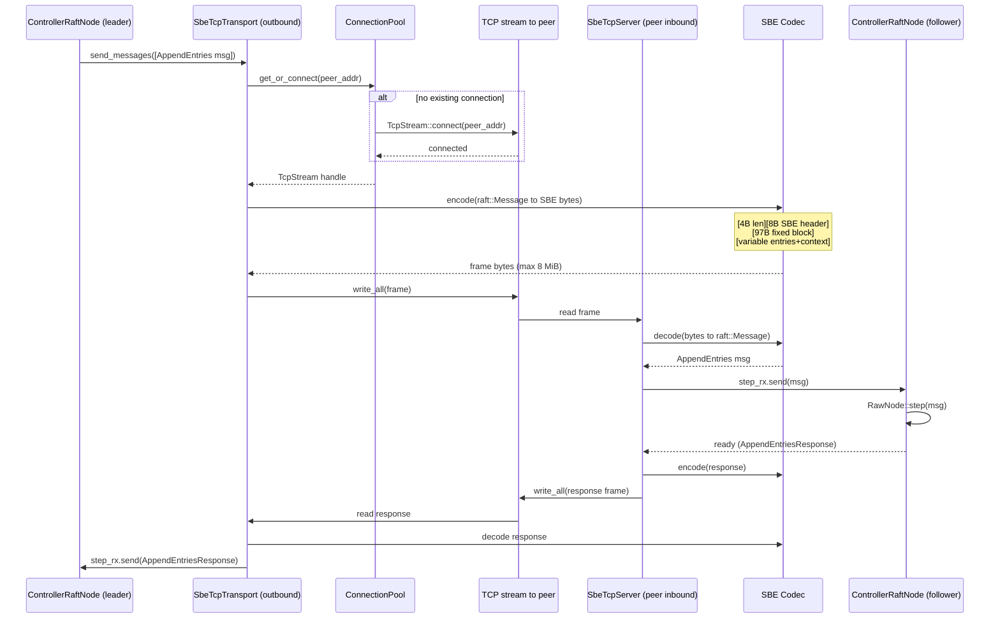
```mermaid
sequenceDiagram
    participant LDR as ControllerRaftNode (leader)
    participant ST as SbeTcpTransport (outbound)
    participant POOL as ConnectionPool
    participant TCP as TCP stream to peer
    participant SS as SbeTcpServer (peer inbound)
    participant CODEC as SBE Codec
    participant FOL as ControllerRaftNode (follower)

    LDR->>ST: send_messages([AppendEntries msg])
    ST->>POOL: get_or_connect(peer_addr)
    alt no existing connection
        POOL->>TCP: TcpStream::connect(peer_addr)
        TCP-->>POOL: connected
    end
    POOL-->>ST: TcpStream handle

    ST->>CODEC: encode(raft::Message to SBE bytes)
    note over CODEC: [4B len][8B SBE header]<br/>[97B fixed block]<br/>[variable entries+context]
    CODEC-->>ST: frame bytes (max 8 MiB)
    ST->>TCP: write_all(frame)

    TCP->>SS: read frame
    SS->>CODEC: decode(bytes to raft::Message)
    CODEC-->>SS: AppendEntries msg
    SS->>FOL: step_rx.send(msg)
    FOL->>FOL: RawNode::step(msg)
    FOL-->>SS: ready (AppendEntriesResponse)
    SS->>CODEC: encode(response)
    SS->>TCP: write_all(response frame)
    TCP->>ST: read response
    ST->>CODEC: decode response
    ST->>LDR: step_rx.send(AppendEntriesResponse)
```

---

## 20. Sequence — Replication Manager Fetch Loop

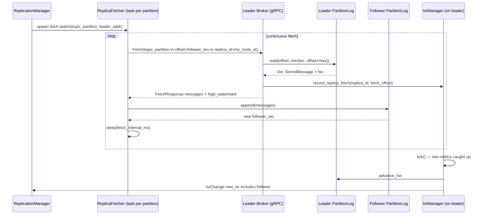
```mermaid
sequenceDiagram
    participant RM as ReplicationManager
    participant RF as ReplicaFetcher (task per partition)
    participant LDR_BK as Leader Broker (gRPC)
    participant LDR_LOG as Leader PartitionLog
    participant FOL_LOG as Follower PartitionLog
    participant ISR as IsrManager (on leader)

    RM->>RF: spawn fetch task\n(topic, partition, leader_addr)

    loop continuous fetch
        RF->>LDR_BK: Fetch(topic, partition,\n  offset=follower_leo,\n  replica_id=my_node_id)
        LDR_BK->>LDR_LOG: read(offset..min(leo, offset+max))
        LDR_LOG-->>LDR_BK: Vec StoredMessage + hw
        LDR_BK->>ISR: record_replica_fetch(replica_id, fetch_offset)
        LDR_BK-->>RF: FetchResponse messages + high_watermark
        RF->>FOL_LOG: append(messages)
        FOL_LOG-->>RF: new follower_leo
        RF->>RF: sleep(fetch_interval_ms)
    end

    ISR->>ISR: tick() — see replica caught up
    ISR->>LDR_LOG: advance_hw
    ISR-->>RM: IsrChange new_isr includes follower
```

---

## 21. Flowchart — PartitionLog Read/Write with LEO & HW

```mermaid
flowchart LR
    subgraph write[Write Path — Leader]
        W1([append messages]) --> W2[encode as LogEntry\noffset = LEO.fetch_add]
        W2 --> W3[sled tree insert\noffset_bytes to LogEntry bytes]
        W3 --> W4[LEO += n\natomic store]
    end

    subgraph replicate[Replication Path]
        R1([follower Fetch RPC]) --> R2{replica_id > 0?}
        R2 -->|yes| R3[record_replica_fetch\nfor ISR tracking]
        R2 -->|no — consumer| R4[skip ISR tracking]
        R3 --> R5
        R4 --> R5
        R5[read sled: offset..min of leo and max]
    end

    subgraph advance[HW Advance — IsrManager tick]
        A1([all ISR replicas\ncaught up]) --> A2[new_hw = min ISR LEOs]
        A2 --> A3[sled insert __hw__ key]
        A3 --> A4[HW atomic store]
    end

    subgraph consumer_read[Consumer Read Path]
        C1([Fetch RPC]) --> C2{offset < HW?}
        C2 -->|yes| C3[read from sled\noffset..HW]
        C2 -->|no| C4[return empty\nnot yet committed]
        C3 --> C5([return messages\n+ high_watermark])
    end

    W4 -.->|triggers| replicate
    A4 -.->|unlocks| consumer_read
```

---

## 22. Flowchart — Raft Leader Election

```mermaid
flowchart TD
    START([All nodes start\nas Followers]) --> TIMER[Start election timer\nrandom 150-300ms]

    TIMER --> TIMEOUT{election\ntimeout fires?}
    TIMEOUT -->|no, heartbeat received| RESET[reset timer]
    RESET --> TIMEOUT

    TIMEOUT -->|yes| CAND[Become Candidate\nbump term\nvote for self]
    CAND --> REQ[send RequestVote\nto all peers]

    REQ --> VOTES{collect votes}
    VOTES -->|quorum granted| LEADER[Become Leader\nbroadcast empty\nAppendEntries heartbeat]
    VOTES -->|higher term seen| FOLLOWER_AGAIN[revert to Follower\nupdate term]
    VOTES -->|split vote or timeout| CAND

    LEADER --> HB_LOOP[heartbeat loop:\nAppendEntries every\nheartbeat_interval_ms]
    HB_LOOP --> HB_LOOP

    LEADER --> CTRL_EPOCH[propose BumpControllerEpoch\nto state machine]
    CTRL_EPOCH --> ACTIVE[Active Controller:\nhandle failure detection\nprocess proposals]
```

---

## 23. Flowchart — MessageEnvelope Codec

```mermaid
flowchart LR
    subgraph produce[Producer side]
        APP([app payload\nbytes]) --> ENV[wrap in MessageEnvelope\nevent_type\nschema_version\ncreated_at_ms\npayload]
        ENV --> ENC{codec?}
        ENC -->|bincode| BIN[bincode::serialize\nbinary bytes]
        ENC -->|json| JSON[serde_json::to_vec\nJSON bytes]
        BIN --> WIRE([wire bytes\nin ProduceRequest])
        JSON --> WIRE
    end

    subgraph consume[Consumer side]
        WIRE2([wire bytes\nfrom FetchResponse]) --> DEC{detect codec}
        DEC -->|starts with 0x00| BIN2[bincode::deserialize]
        DEC -->|starts with 0x7B| JSON2[serde_json::from_slice]
        BIN2 --> ENV2[MessageEnvelope]
        JSON2 --> ENV2
        ENV2 --> OUT([app reads\nevent_type + payload])
    end
```

---

## 24. Flowchart — BrokerCore RPC Dispatch

```mermaid
flowchart TD
    GRPC([KafkaBrokerServer\nTonic handler]) -->|mpsc send| CHAN[(BrokerGrpcRequest\n+ oneshot Sender)]

    CHAN --> BC[BrokerCore\nevent loop]
    BC --> ROUTER[BrokerRpcRouter\nmatch request variant]

    ROUTER -->|GetTopicMetadata| META[handle_get_topic_metadata]
    ROUTER -->|CreateTopic| CREATE[handle_create_topic]
    ROUTER -->|Produce| PROD_H[handle_produce\nor produce_message_acks_all]
    ROUTER -->|Fetch| FETCH_H[handle_fetch]
    ROUTER -->|ListOffsets| LIST_OFF[handle_list_offsets]
    ROUTER -->|FindCoordinator| FIND_COORD[handle_find_coordinator]
    ROUTER -->|JoinGroup| JOIN_H[handle_join_group -> cgc]
    ROUTER -->|SyncGroup| SYNC_H[handle_sync_group -> cgc]
    ROUTER -->|Heartbeat| HB_H[handle_heartbeat -> cgc]
    ROUTER -->|LeaveGroup| LEAVE_H[handle_leave_group -> cgc]
    ROUTER -->|CommitOffset| COMMIT_H[handle_commit_offset -> cgc]
    ROUTER -->|FetchOffset| FETCH_OFF[handle_fetch_offset -> cgc]
    ROUTER -->|AddNode| ADD_H[handle_add_node\n-> storage.add_node]
    ROUTER -->|RemoveNode| REM_H[handle_remove_node\n-> storage.remove_node]

    META & CREATE & PROD_H & FETCH_H & LIST_OFF & FIND_COORD --> REPLY
    JOIN_H & SYNC_H & HB_H & LEAVE_H & COMMIT_H & FETCH_OFF --> REPLY
    ADD_H & REM_H --> REPLY

    REPLY[oneshot send\nBrokerGrpcResponse] --> GRPC2([Tonic returns\ngRPC response])
```
